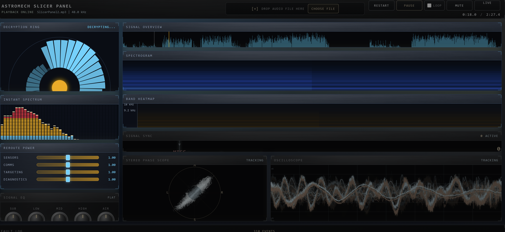

# Astromech Slicer Panel

A sci-fi audio data visualization web app that analyzes uploaded audio files and presents coordinated charts styled like a Star Wars astromech hacking console. Built with **vanilla HTML, CSS, and JavaScript** — no frameworks, no build step, no dependencies.



> **[Live Demo](https://kylephoto.blob.core.windows.net/spring-into-ai/fft/index.html)** · **[Deep Wiki Documentation](https://deepwiki.com/arkbuilder/slicer-panel)** · **[Blog Post](https://ericrhea.com/spring-into-ai/week-1-astromech-splicer-panel.html)**

---

## Application Modes

The repository contains three distinct applications:

| Mode | Entry Point | Description |
|------|-------------|-------------|
| **Panel View** | `index.html` | Comprehensive analysis dashboard with 8+ simultaneous visualizations, power controls, and 5-band EQ |
| **Live Mode** | `Live.html` | Full-screen beat-synchronized visualization with theatrical transitions and auto-switching charts |
| **RSX-2 Analyzer** | `index_v1.html` | Self-contained hardware-inspired spectrum analyzer (the original upstream project) |

---

## Features

### Visualizations
- **Decryption Ring** — Radial 40-arc frequency band view with sci-fi animation
- **Instant Spectrum** — Real-time 40-bar vertical spectrum display
- **Band Heatmap** — Time × frequency energy heatmap across 40 logarithmic bands
- **Spectrogram** — Scrolling frequency × time waterfall display
- **Overview Waveform** — Full-track waveform with brush-to-zoom selection
- **Oscilloscope** — Real-time time-domain waveform display
- **Stereo Phase Scope** — Lissajous stereo field visualization
- **Signal Sync (Beat Tap)** — Rhythm game layer synced to detected onsets

### Interactive Controls
- **Reroute Power** — Visual re-weighting sliders that redistribute energy across frequency bands
- **5-Band Signal EQ** — Orbital-drag dial controls for real-time equalization
- **Transport** — Play/Pause, Restart, Loop toggle, Mute, and time display
- **Brush Selection** — Click-drag on the overview waveform to zoom into a time region
- **Cross-Chart Linking** — Playhead, hover, and selection sync across all charts

### Fault Log
Automated fault detection triggered by real signal properties:
- Clipping / peak overloads
- Silence gaps
- Sudden spectrum changes
- Phase anomalies

### Live Mode
- Eight transition effects: glitch, zoom-rotate, slide, iris, scan, blur-flash, diamond, pixel
- Automatic chart switching on detected beat onsets
- Theatrical curtain animations

---

## Getting Started

1. **Clone the repo**
   ```bash
   git clone https://github.com/arkbuilder/slicer-panel.git
   cd slicer-panel
   ```

2. **Serve locally** (any static server works)
   ```bash
   npx serve .
   # or: python -m http.server 8000
   ```

3. **Open in browser**
   - Panel View: `http://localhost:3000/index.html`
   - Live Mode: `http://localhost:3000/Live.html`

4. **Upload an audio file** — drag & drop or click the file picker. Supported formats: WAV, MP3, FLAC, OGG, and other browser-compatible audio.

---

## Architecture

### Data Flow

```
AUDIO FILE (drag-drop / file picker)
    │
    ▼
┌──────────────────────────┐
│  audio-decode.js         │  decodeAudioData() → AudioBuffer
│  (main thread)           │  → Float32Array per channel
└──────────┬───────────────┘
           │ postMessage(samples)
           ▼
┌──────────────────────────────────────────────────────────────┐
│  precompute-worker.js  (Web Worker)                          │
│                                                              │
│  1. Downsample → LOD waveforms                               │
│  2. RMS envelope                                             │
│  3. STFT (Hann 2048, hop 512) → magnitudes per frame         │
│  4. 40 log bands per frame                                   │
│  5. Spectral flux + onset detection                          │
│  6. Phase correlation                                        │
│  7. Fault detection                                          │
└──────────┬───────────────────────────────────────────────────┘
           │ onmessage (results)
           ▼
┌──────────────────────────┐
│  state.js                │  Stores all precomputed arrays
│  (main thread)           │  Emits 'data-ready' via bus
└──────────┬───────────────┘
           │ bus events
           ▼
┌──────────────────────────────────────────────────────────────┐
│  CHART MODULES (each subscribes to bus)                      │
│                                                              │
│  overview-waveform · spectrogram · band-heatmap              │
│  decryption-ring · instant-spectrum · fault-log              │
│  oscilloscope · phase-scope · beat-tap                       │
└──────────────────────────────────────────────────────────────┘
```

### Event-Driven Communication

All modules communicate through a lightweight pub/sub event bus. Visualization modules subscribe to events and read state via getters — no module directly calls methods on another module.

| Event | Description |
|-------|-------------|
| `FILE_LOADED` | Audio file decoded and ready |
| `DATA_READY` | Precomputation complete |
| `PLAYHEAD_UPDATE` | Current playback position changed |
| `EQ_CHANGE` | EQ dial values adjusted |
| `POWER_CHANGE` | Power reroute weights changed |
| `RESIZE` | Window resized |

### Technical Specs

- **FFT Size:** 2048 samples, hop 512, Hann window
- **Frequency Bands:** 40 logarithmic bands (20 Hz – 20 kHz)
- **Rendering:** Canvas 2D for all charts; DOM for fault log
- **Audio:** Web Audio API (`AudioBufferSourceNode` + `AnalyserNode` + `BiquadFilterNode`)
- **Stereo:** Independent left/right channel analysis via `ChannelSplitter`
- **Workers:** Heavy FFT/analysis offloaded to Web Worker with Transferable arrays

---

## File Structure

```
slicer-panel/
├── index.html                      # Panel View entry point
├── Live.html                       # Live Mode entry point
├── index_v1.html                   # Original RSX-2 analyzer (reference)
├── css/
│   └── slicer.css                  # Styles, sci-fi theme (CSS custom properties)
├── js/
│   ├── main.js                     # Panel View bootstrap
│   ├── live-main.js                # Live Mode bootstrap
│   ├── bus.js                      # Event bus (pub/sub)
│   ├── state.js                    # State store + BUS_EVENTS enum
│   ├── audio-decode.js             # File upload + decodeAudioData
│   ├── audio-playback.js           # Playback engine
│   ├── precompute.js               # Web Worker orchestrator
│   ├── interactions.js             # Power controls, cross-chart linking
│   ├── eq-dials.js                 # 5-band EQ orbital dial controls
│   ├── theme.js                    # Decryption animation, scanline FX
│   ├── touch-utils.js              # Unified pointer/touch event helpers
│   └── charts/
│       ├── overview-waveform.js    # Full-track waveform with brush-to-zoom
│       ├── spectrogram.js          # Frequency × time heatmap
│       ├── band-heatmap.js         # 40-band energy heatmap
│       ├── decryption-ring.js      # Radial 40-arc band view
│       ├── instant-spectrum.js     # 40-bar vertical spectrum
│       ├── oscilloscope.js         # Time-domain waveform
│       ├── phase-scope.js          # Stereo Lissajous display
│       ├── beat-tap.js             # Rhythm game / signal sync
│       └── fault-log.js            # Fault event list (DOM-based)
├── workers/
│   └── precompute-worker.js        # Web Worker: FFT, bands, RMS, faults
├── lib/
│   └── fft.js                      # Radix-2 FFT implementation
├── assets/                         # Favicon, textures
├── Plans/                          # Detailed architecture & design docs (14 plans)
└── Prompts/                        # Original planning & implementation prompts
```

---

## Adding a New Visualization

1. Create `js/charts/my-chart.js` exporting `initMyChart(canvasId, bus, state)`
2. Subscribe to events: `bus.on(BUS_EVENTS.DATA_READY, callback)`
3. Read state: `state.getPrecomputed()`, `state.getAnalysers()`, or `state.getDecoded()`
4. Add `<canvas id="my-canvas" class="chart-canvas">` to `index.html`
5. Register in `js/main.js` boot sequence and push the cleanup function

---

## Requirements

- Modern browser with Web Audio API support (Chrome, Firefox, Safari, Edge)
- Local audio files (WAV, MP3, FLAC, OGG)
- No server-side processing required — everything runs client-side

---

## Design Philosophy

The Astromech Slicer Panel is designed to feel like a Star Wars astromech droid hacking into an encrypted signal. Every chart is a real, legible, informative data visualization — not a fake animation. The sci-fi aesthetic (amber glows, cyan accents, scan lines, fault alerts) is layered on top of genuine spectral analysis, making the tool both visually striking and analytically useful.

The coordinated multi-chart approach lets you see the same audio data across different dimensions simultaneously: full-track overview, frequency × time, instantaneous spectrum, stereo phase, and rhythmic structure — all linked through a shared playhead and event bus.

---

Built with vanilla JavaScript and the Web Audio API. No frameworks, no dependencies. Zero build step — open `index.html` and it works.
